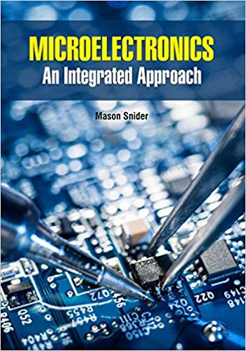
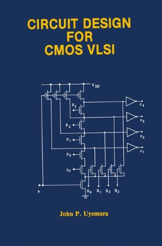

1- jan M Rabaey, "Digital integrated Circuits,A Design Perspective." pretice Hali, 1996.

2- M.shoji,CMOS DIgital intergrated Circuits Technology,prentice-Hall Inc,1993.

3- A. S sedra and K.C swith Microelectronic Circuits, 4th Edition,Oxford University press, 1993,Chapter 13 and 14

4- R. T Owe,and C. G sodini, Micro electronics, An intergrated Approach, prentice Hall,1997.

5- John P. Uyemura CIrcuit Desing for CMOS VLSL Kluwer Academic publishiers, 1992.

<h2> other resources <h2>

